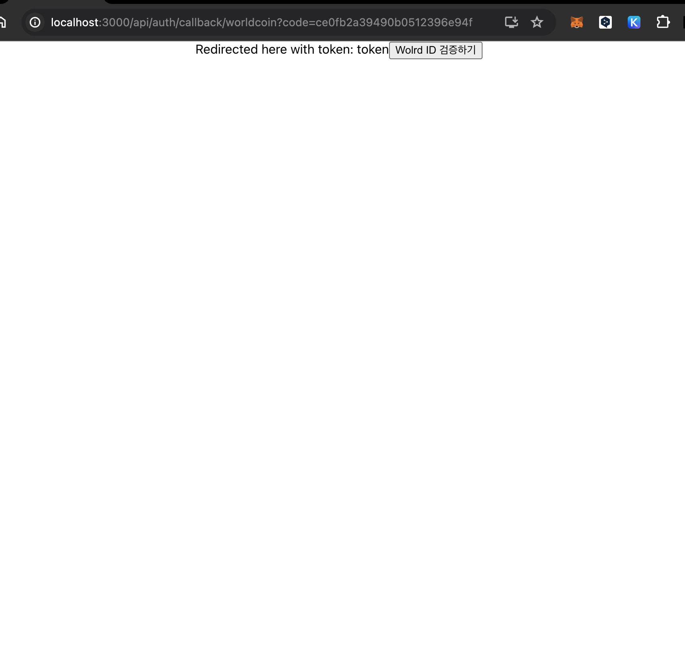

## Start App
### Back-end (Node.ts)
```bash
cd ./back
npm install

ts-node app.ts
```
> [INFO] 디렉토리에 `.env`를 저장한 후, `ts-node app.ts`를 실행합니다.

### Front-end (React)
```bash
cd ./world-sign-front
npm install

npm start
```
> [INFO] 디렉토리에 `.env`를 저장한 후, `npm start`를 실행합니다.
> [WARN] World SignIn의 리다이렉트 URL은 `http://localhost:3000/api/auth/callback/worldcoin`로 설정되어 있습니다.

## Guide
### (1) 시작화면
`Sign In` 버튼을 누른다.


### (2) World Coin 0Auth page
보유중인 worldCoin 앱을 통해 로그인을 진행한다.<br/>
만약 worldCoin 계정이 없는 경우, [시뮬레이션](https://simulator.worldcoin.org)을 통해 로그인을 진행한다.

> [INFO] World Coin 0Auth URL은 `src/page/home.tsx`에 정의되어 있습니다.


### (3) World Coin 0Auth page
로그인에 성공하면, World Coin은 `http://localhost:3000/api/auth/callback/worldcoin`로 리다이렉트하며, `coin=`에 사용자의 id를 전달한다.<br/>
`World Id 검증하기`를 클릭하면, [POST]http://localhost:3001/getToken를 호출하여, 사용자의 access_token을 발급한다.
> [INTO] API 호출 시, `coin=`를 같이 전달한다.



### (4) 결과 Log로 확인하기
#### Front Log
<br/>

#### Back Log


## Reference
- world sign in Docs : https://docs.worldcoin.org/sign-in
- world sign in API : https://docs.worldcoin.org/reference/sign-in
- WorldCoin Simulator : https://simulator.worldcoin.org